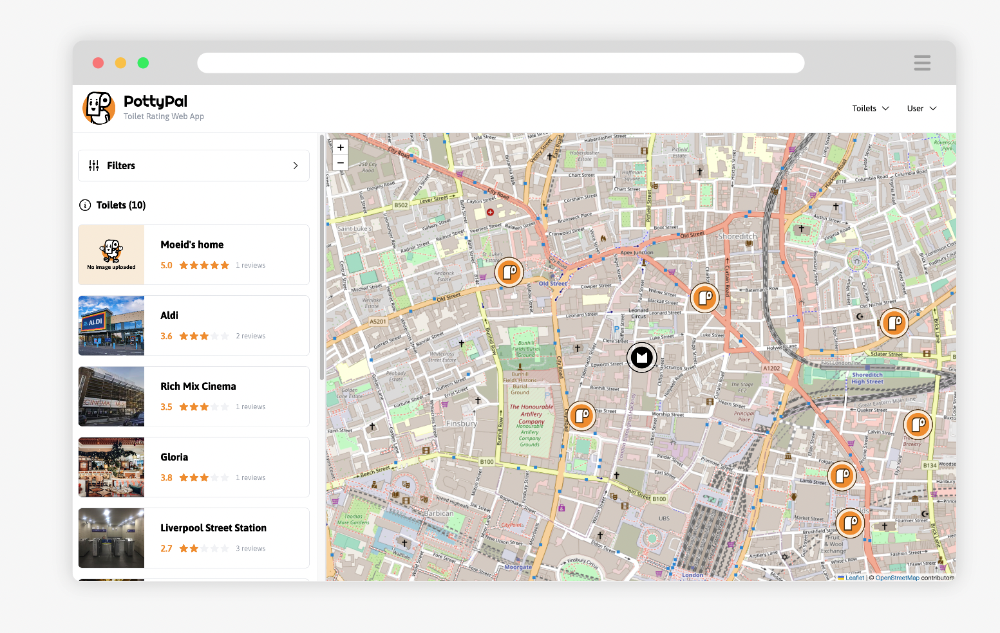
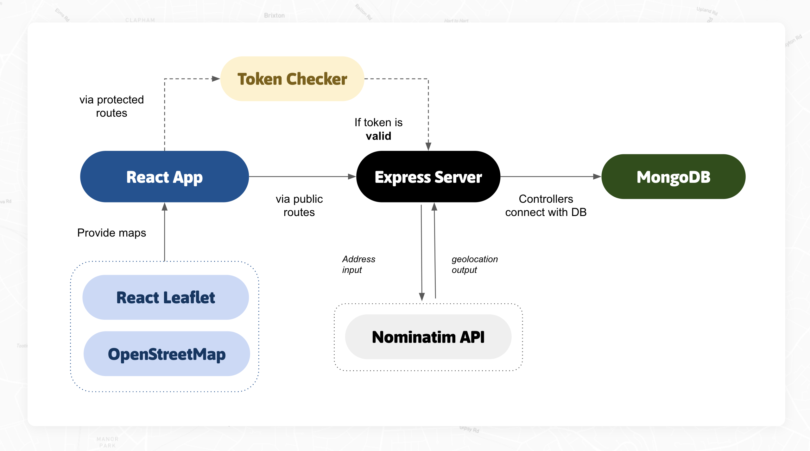
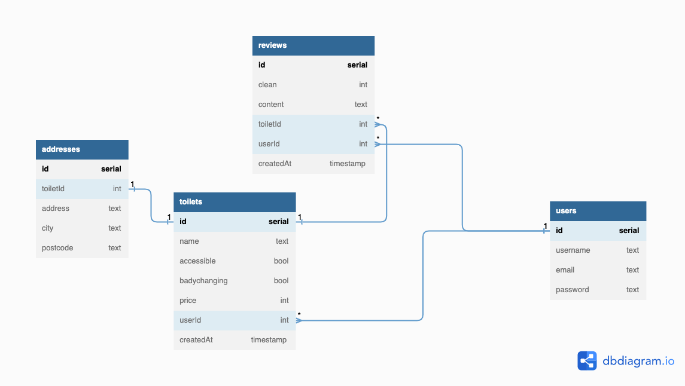

<a name="readme-top"></a>

<br />
<!-- PROJECT LOGO -->
<div align="center">
  <a href="https://github.com/terryhycheng/acebook">
    
  </a>

<h3 align="center">PottyPal</h3>
<p>A MERN Stack Toilet Finding App</p>

  <p align="center">
    <a href="https://potty-pal-frontend.onrender.com/">💻 View Demo</a>
    ·
    <a href="https://docs.google.com/presentation/d/18HRkplZd6_S4CVVg7y47VUbVzs6aihjLZcJ3n5it9aM/edit?usp=sharing">🚀 Presentation Deck</a>
    ·
    <a href="https://github.com/terryhycheng/potty-pal/issues">⚡ Report Bug</a>
  </p>
</div>

<!-- TABLE OF CONTENTS -->

## Table of Contents

- [Table of Contents](#table-of-contents)
- [About the Project](#about-the-project)
  - [Features](#features)
  - [Tech Stack](#tech-stack)
- [Infrastructure](#infrastructure)
  - [App Diagram](#app-diagram)
  - [Database Diagram](#database-diagram)
- [Getting Started](#getting-started)
  - [Prerequisites](#prerequisites)
  - [Installation](#installation)
    - [Clone the project](#clone-the-project)
    - [Install packages](#install-packages)
    - [Setup `.env` files](#setup-env-files)
  - [Start](#start)
    - [Run the app](#run-the-app)
- [Contributors](#contributors)

<!-- ABOUT THE PROJECT -->

## About the Project



PottyPal is a toilet finding web app. It has a number of features that can be easily accessed from a UI to generate a list of toilets in a particular location. The app displays the 'Potty Pal' logo, as a pins on a map with easy to read pop-ups offering information about specific toilets, including facilities, pricing and ratings.

### Features

- **View toilets on a map**: Pottypal provides a map for users to view a list of toilets in an esay way
- **Add toilets**: Users are able to add new toilets with name, price, features and address
- **Add reviews to a toilet**: Users are able to add reviews to each toilet
- **Updload images of the toilet**: Pottypal can handle multiple image upload up to 5MB
- **Authentication**: Users are able to log in / sign up

<p align="right">(<a href="#readme-top">back to top</a>)</p>

### Tech Stack

This project was built with the following tools:

- [![React][react-shield]][react-url]
- [![mongodb][mongodb-shield]][mongodb-url]
- [![express][express-shield]][express-url]
- [![tailwindcss][tailwindcss-shield]][tailwindcss-url]
- [![Cypress][cypress-shield]][cypress-url]
- [![Jest][jest-shield]][jest-url]

<p align="right">(<a href="#readme-top">back to top</a>)</p>

## Infrastructure

### App Diagram

The diagram below shows the relationships among all parties, including `OpenStreetMap` and `Nominatim API`.



<p align="right">(<a href="#readme-top">back to top</a>)</p>

### Database Diagram

Even though we used `mongoDB` which is a non-SQL database for PottyPal, we still picked SQL diagram as the tool to show the relationships among documents during the planning stage.



<p align="right">(<a href="#readme-top">back to top</a>)</p>

<!-- GETTING STARTED -->

## Getting Started

This section shows you how to set up this project locally. First, get a local copy up and running follow these simple steps.

### Prerequisites

You have to make sure that `mongodb`, `npm` and `node` have been installed in your local machine before running the project. If not, follow the steps below.

- npm

  ```sh
  npm install npm@latest -g
  npm -v
  ```

- nvm & node

  ```sh
  # visit https://github.com/nvm-sh/nvm on how to install nvm
  nvm install node
  node -v
  ```

- mongodb
  ```sh
  brew tap mongodb/brew
  brew install mongodb-community@5.0
  brew services start mongodb-community@5.0
  ```
  <p align="right">(<a href="#readme-top">back to top</a>)</p>

### Installation

#### Clone the project

```bash
  git clone https://github.com/terryhycheng/potty-pal
```

#### Install packages

```bash
cd potty-pal
npm run install
```

#### Setup `.env` files

Before running the app, two `.env` has to be set up. The following lines are the template.

```bash
# backend/.env
JWT_SECRET=
MONGODB_URL=

# frontend/.env
REACT_APP_API_URL="http://localhost:8080" # or change it to a deployed server url
```

<p align="right">(<a href="#readme-top">back to top</a>)</p>

### Start

#### Run the app

We installed `concurrently` so one command can run both the frontend and backend server. Port `3000` and `8080` are the default ports.

```bash
  npm run start
```

<p align="right">(<a href="#readme-top">back to top</a>)</p>

<!-- CONTRIBUTORS -->

## Contributors

We are team `PottyPal`, a team of five amazing, passionate and lovely software developers who care about toilets so much that we made an application for it.

<table>
  <tr>
   <td align="center"><a href="https://github.com/AmberG31"><br />Amber</a></td>
   <td align="center"><a href="https://github.com/pieslappa"><br />Chris Leech</a></td>
   <td align="center"><a href="https://github.com/ChalkandFeather"><br />Marie Taylor</a></td>
  <td align="center"><a href="https://github.com/moeid9"><br />Moeid Haider</a></td>
   <td align="center"><a href="https://github.com/terryhycheng"><br />Terry Cheng</a></td>
  </tr>
</table>

<p align="right">(<a href="#readme-top">back to top</a>)</p>

[typescript-shield]: https://img.shields.io/badge/Typescript-3178c6?style=for-the-badge&logo=typescript&logoColor=white
[typescript-url]: https://www.typescriptlang.org/
[circleci-shield]: https://img.shields.io/badge/circleci-000000?style=for-the-badge&logo=circleci&logoColor=white
[circleci-url]: https://circleci.com/
[jest-shield]: https://img.shields.io/badge/jest-c21325?style=for-the-badge&logo=jest&logoColor=white
[jest-url]: https://jestjs.io/
[react-shield]: https://img.shields.io/badge/reactjs-20232a?style=for-the-badge&logo=react&logoColor=61dafb
[react-url]: https://reactjs.org/
[cypress-shield]: https://img.shields.io/badge/cypress-007780?style=for-the-badge&logo=cypress&logoColor=white
[cypress-url]: https://www.cypress.io/
[tailwindcss-shield]: https://img.shields.io/badge/tailwindcss-0f172a?style=for-the-badge&logo=tailwindcss&logoColor=38BDF8
[tailwindcss-url]: https://tailwindcss.com/
[mongodb-shield]: https://img.shields.io/badge/mongodb-023430?style=for-the-badge&logo=mongodb&logoColor=white
[mongodb-url]: https://www.mongodb.com/
[express-shield]: https://img.shields.io/badge/express-000000?style=for-the-badge&logo=express&logoColor=white
[express-url]: https://expressjs.com/
